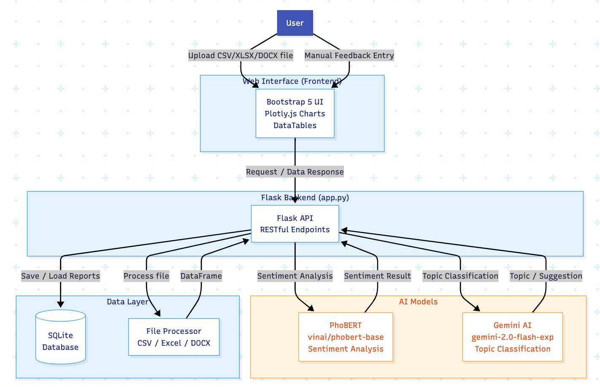

<h2 align="center">
    <a href="https://dainam.edu.vn/vi/khoa-cong-nghe-thong-tin">
    🎓 Faculty of Information Technology (DaiNam University)
    </a>
</h2>
<h2 align="center">
   ỨNG DỤNG PHÂN TÍCH CẢM XÚC TỪ PHẢN HỒI SINH VIÊN TRÊN FACEBOOK
</h2>

    

        
        
        
    

# Feedlytics: AI-Powered Customer Feedback Intelligence Platform (Vietnam)

**Feedlytics** is a sophisticated *Customer Feedback Intelligence Platform* designed for automated analysis of Vietnamese e-commerce reviews. By integrating **Large Language Models (LLMs)** and **Deep Learning**, the system efficiently converts unstructured textual feedback into **actionable business intelligence**, delivering high-fidelity **sentiment classification** and **topic modeling** to support strategic decision-making.

---

## Key Features

| **Component** | **Technical Description** |
|---------------|----------------------------|
| **Sentiment Classification (PhoBERT)** | Fine-tuned `vinai/phobert-base` on a 20,000-sample e-commerce corpus, achieving **93.4% accuracy** in ternary classification (Positive / Negative / Neutral). |
| **Topic Modeling & Actionable Recommendations (Gemini AI)** | Employs **Gemini-Flash** with few-shot prompting for automated classification into **6 primary domains** (e.g., Product Quality, Logistics, Customer Service) and generation of **three targeted improvement strategies**. |
| **Multi-Format Batch Processing** | Supports seamless ingestion of **CSV, Excel (.xlsx), and DOCX** files via a user-centric web interface (Flask + Bootstrap 5). |
| **High-Performance Inference** | Processes **1,000 feedback instances in approximately 12.5 seconds** using GPU acceleration (NVIDIA RTX 3060). |
| **Interactive Analytics Dashboard** | Real-time visualization powered by **Plotly.js**, including sentiment distribution, rating histograms, topic prevalence, and searchable data tables. |

---

## System Architecture

> **Extended 3-Tier Architecture with Dedicated AI Layer**  
> - **Frontend Layer**: Responsive interface using Bootstrap 5, Plotly.js, and DataTables  
> - **Backend Layer**: Flask-based RESTful services, session management, and secure file parsing  
> - **AI Layer**: PhoBERT for sentiment inference; Gemini AI for topic classification and recommendation synthesis; PyTorch for GPU-accelerated execution  
> - **Persistence Layer**: SQLite for user authentication and report archival
---
## Installation & Deployment
1. System Requirements
s
Python: 3.10 or later
GPU: NVIDIA (recommended for PhoBERT inference and training)
CUDA Toolkit: 11.8 or compatible

2. Dependency Installation
bashpip install -r requirements.txt
Key dependencies include: torch, transformers, flask, pandas, google-generativeai, openpyxl, python-docx, plotly, scikit-learn
3. Launch Application
bashpython app.py
---

  <strong>By: Nguyễn Thị Mai Hương</strong> 
  Information Technology, Đại Nam University, Vietnam 
  Email: <a href="mailto:HuongMaiNg@example.com">3sevenm@gmail.com</a>

